# Hosting a Static Website with CloudFront and AWS S3

## Overview

Create a static website on Amazon S3 bucket(private bucket) but with public read policy assigned, using cloud front for Content Delivery Network.

## Introduction

Hosting a website on the cloud is a top choice, and Amazon Web Services (AWS) provides fantastic options, especially for static sites, with services like S3 buckets and CloudFront. 

S3 buckets act as digital containers in the cloud, perfect for storing various website essentials like HTML, CSS, JavaScript, and images. They're reliable, scalable, and easy to set up for website hosting.

For the sake of this project, I'll create an IAM user with precise permissions tailored for hosting a static website on S3 and CloudFront, adhering to the principle of least privilege. With this user in place, I'll configure an S3 bucket to host the website files and enable static website hosting. Then, I'll set up a CloudFront distribution to boost website performance by caching content at edge locations worldwide. This setup acts as a content delivery network, reducing latency and ensuring a smooth user experience.

## Prerequisite

1. An AWS account
2. The files to upload for your static website.

# Steps

Step 1: Create a Bucket on Amazon S3

i. Click on create bucket to enter your desired bucket name.

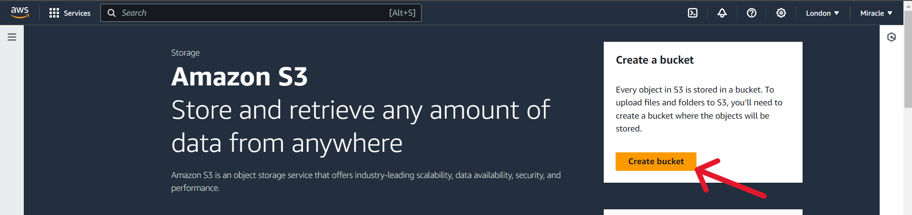

ii. Enter a unique name for the Bucket name field, ensuring it hasn't been used before. Then, proceed to uncheck the "Block all public access" option.

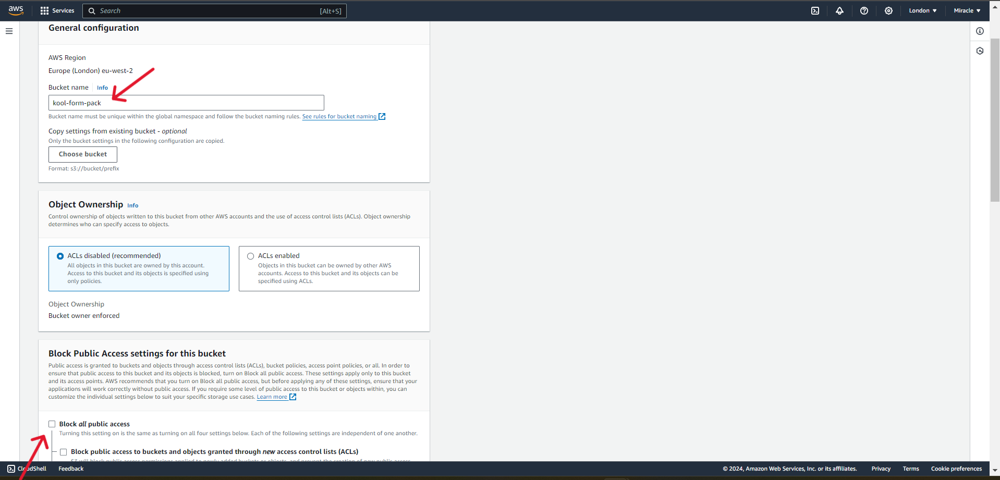

iii. Scroll down and check the acknowledgment box.

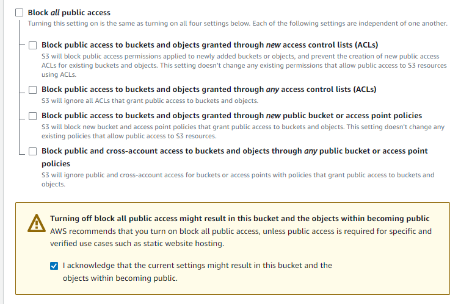

iv. Keep all other settings as default, then scroll down and click on "Create Bucket."

## Step 2: Upload Website files to S3 Bucket

i. Click on the bucket name and upload the files and folders of the website.

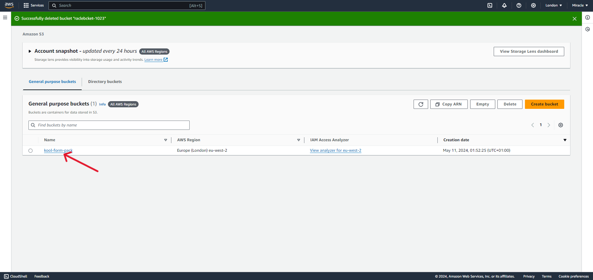

ii. Click on "Upload" and choose the files from your local file storage. Be careful not to upload the top-level folder containing other folders. Upload each folder separately to ensure they open correctly in your browser.

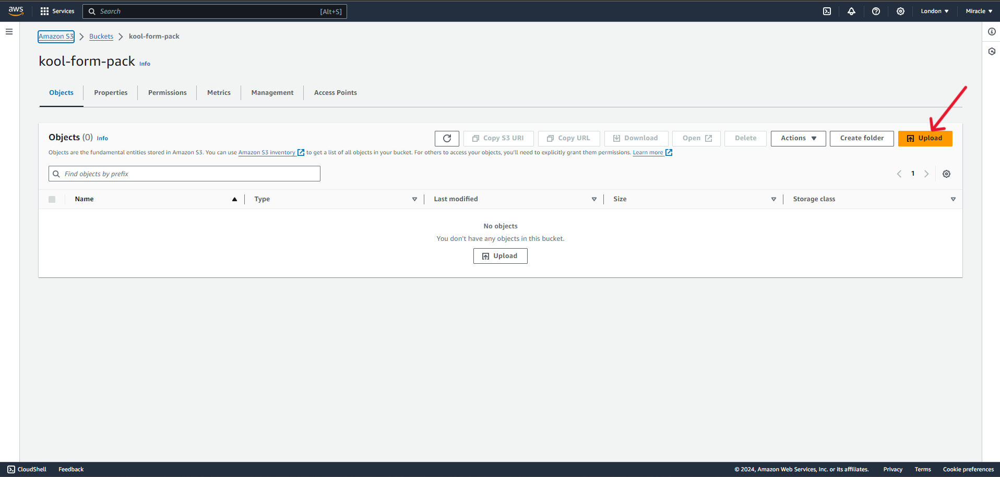

iii. Once you've selected the folders and files from your local file storage, click on "Upload" to proceed.

iv. Allow some time for the files to upload succesfully. Eventually, you'll see a small green bar indicating a successful upload. The click "close".

## Step 3:Enable Static Website Hosting on S3 Bucket Created

i. Navigate to the Properties tab and scroll down to find the Static website hosting section, after that click on the edit.

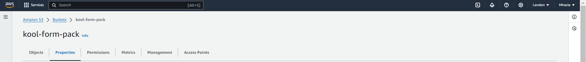

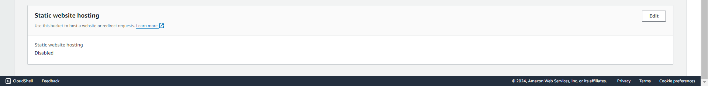

ii. Select the "Enable" radio button. Then, under the hosting type, choose "Host a static website." In the Index document field, enter "index.html."

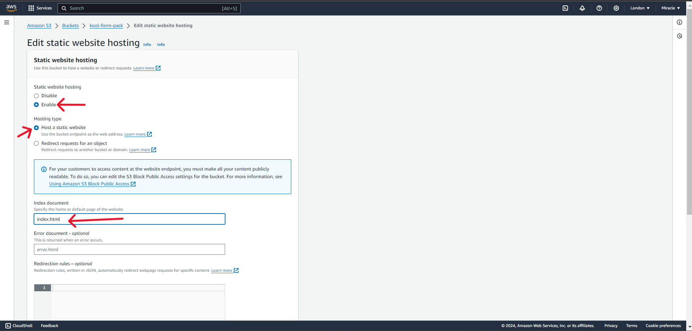

Keep all other settings as default, then scroll down and click "Save Changes."

## Step 4 - Create And Set-up CloudFront Distribution

i. search for cloud front in the search bar and click on it, when it opens click on "Create a CloudFront distribution"

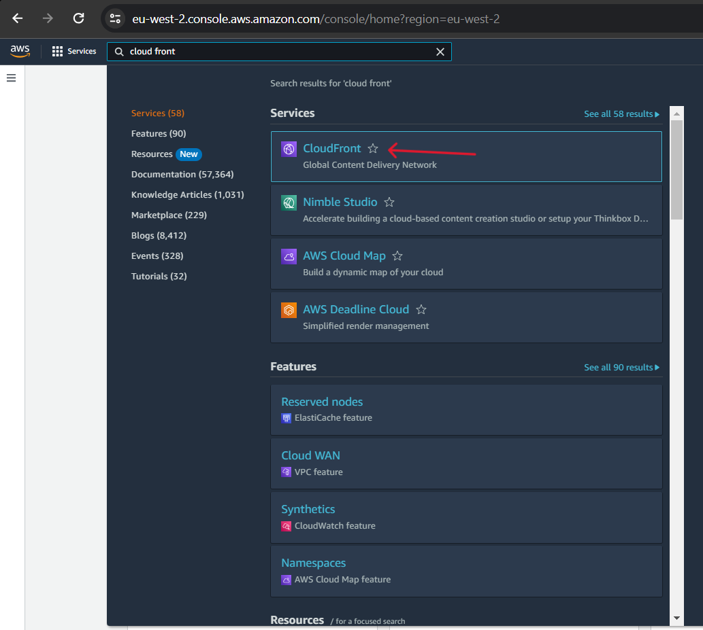
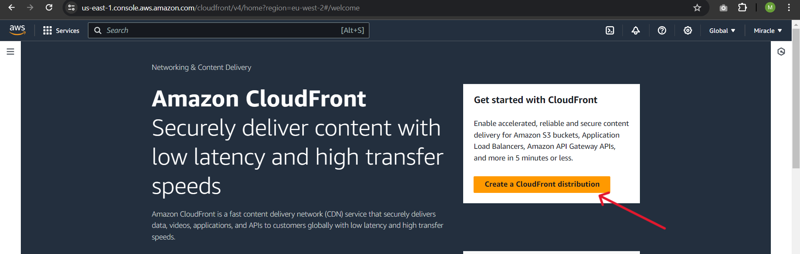

ii. In the "Origin domain" field, input the URL you used to access your website, which is found in your created S3 bucket under Properties >> Static website hosting. Avoid clicking on "Use website endpoint" as it won't display the Origin access control settings necessary to make your bucket private.

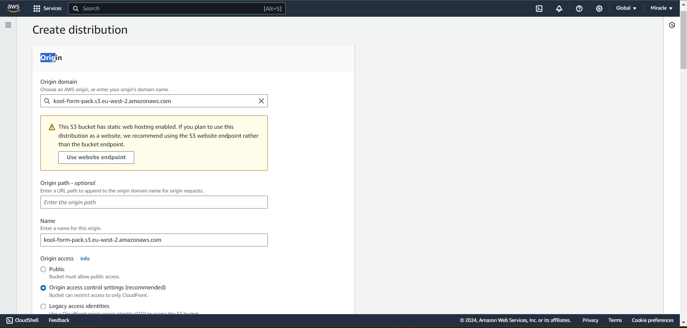

iii. Since there is no existing Original Access Control (OAC), we'll need to create one. Click on "Create new OAC."

iv. After clicking on create OAC you should see a page like this, keep all settings as default. Then click "create".

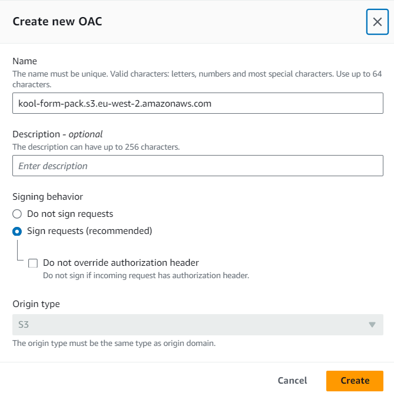

v. For Web Application Firewall (WAF), select the radio button for "Do not enable security protections."

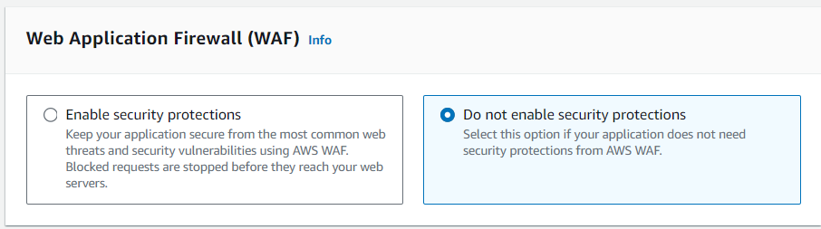

after the above step, leave everything as default and click "Create distribution".

vi. 

## Step 5 - Attach a Bucket Policy

i. Navigate to the Permissions tab and scroll down to find the "Bucket policy", then click on "edit".

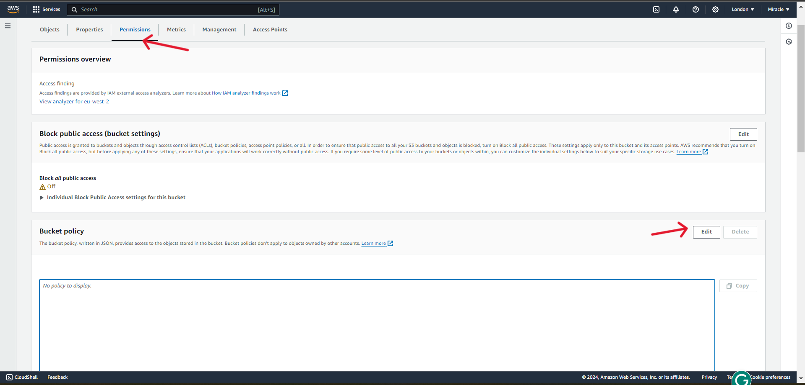

